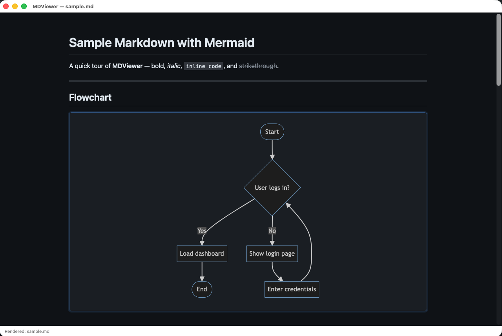
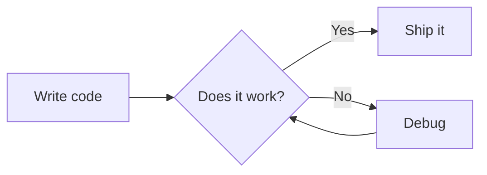

# MDViewer

A lightweight desktop Markdown viewer built with C++ and wxWidgets. Renders Markdown files — including [Mermaid](https://mermaid.js.org) diagrams — entirely offline, with light and dark mode support.



## Features

- **Markdown rendering** — headings, bold, italic, strikethrough, inline code, links, images, blockquotes, ordered/unordered lists, tables, horizontal rules, hard line breaks
- **Mermaid diagrams** — flowcharts, sequence diagrams, class diagrams, Gantt charts, pie charts, and more — rendered as SVG
- **Diagram zoom** — click any diagram to open a full-screen view; scroll to zoom, drag to pan, ESC to close
- **HTML passthrough** — open `.html` files directly; relative images and CSS resolve correctly
- **Light / dark mode** — toggle via the View menu; preference is persisted between sessions
- **Fully offline** — Mermaid.js is compiled into the binary at build time; no network required at runtime

## Dependencies

| Dependency | Version | Notes |
|---|---|---|
| [wxWidgets](https://wxwidgets.org) | 3.2+ | Core GUI + WebView + WebKit |
| CMake | 3.16+ | Build system |
| `xxd` | any | Ships with Vim / available on all platforms |
| Internet (build only) | — | Auto-downloads `mermaid.min.js` once at CMake configure time |

On macOS, install wxWidgets via Homebrew:

```bash
brew install wxwidgets
```

## Build

```bash
git clone https://github.com/your-username/mdviewer.git
cd mdviewer
mkdir build && cd build
cmake ..
make
```

On first run, CMake downloads `mermaid.min.js` automatically and embeds it into the binary via `xxd`. Subsequent builds are fully offline.

## Usage

```bash
mdviewer <file.md>
mdviewer <file.html>
```

### Keyboard shortcuts

| Shortcut | Action |
|---|---|
| `Ctrl+O` | Open file |
| `Ctrl+R` | Reload current file |
| `Ctrl+Shift+L` | Light mode |
| `Ctrl+Shift+D` | Dark mode |
| `Ctrl+Q` | Quit |
| `ESC` | Close diagram zoom |

### Install (add to PATH)

```bash
sudo ln -s $(pwd)/build/mdviewer /usr/local/bin/mdviewer
```

## Mermaid diagrams

Any fenced code block tagged `mermaid` is rendered as a diagram:

````markdown

````

Click the rendered diagram to open the zoom modal.

## How it works

```
mdviewer file.md
    │
    ├─ RenderMarkdown()      hand-written block + inline parser → HTML body
    │
    ├─ WrapWithTemplate()    wraps body in a full HTML page:
    │     • inlines mermaid.min.js as a <script> tag
    │     • applies CSS theme (light / dark)
    │     • adds zoom modal JS
    │
    └─ wxWebView::SetPage()  hands the HTML to an embedded WebKit engine
                             WebKit runs Mermaid, renders SVG diagrams
```

`mermaid.min.js` is never fetched at runtime. At build time, CMake runs `xxd -i` to convert the JS file into a C byte array (`mermaid_js.h`), which is compiled directly into the binary. At runtime, `GetMermaidJS()` reconstructs the string from that array and injects it inline into every rendered page.

## Project structure

```
mdviewer/
├── CMakeLists.txt      Build config — downloads + embeds Mermaid.js
├── main.cpp            wxApp entry point, argument handling
├── mdviewer.h          MDViewerFrame class declaration
├── mdviewer.cpp        Markdown parser, HTML template, wxWebView wiring
├── mermaid.min.js      Downloaded once at configure time (gitignored)
└── sample.md           Feature demo — open this to test the app
```

## License

MIT
